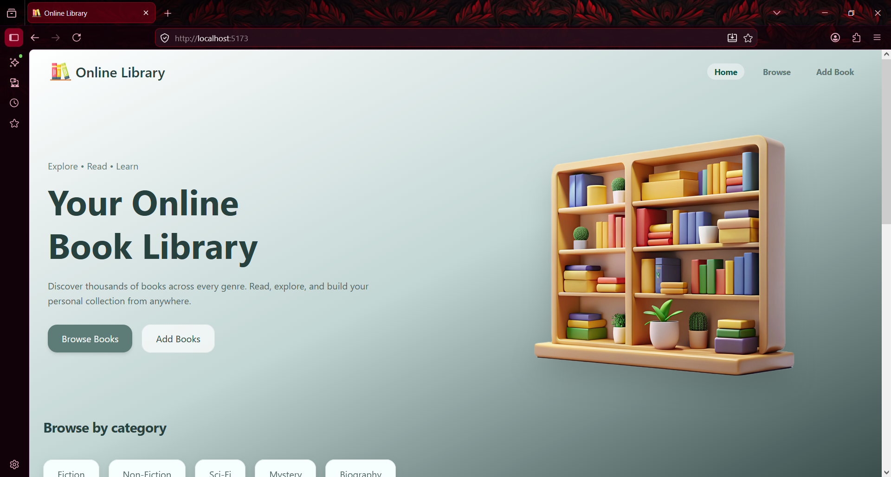
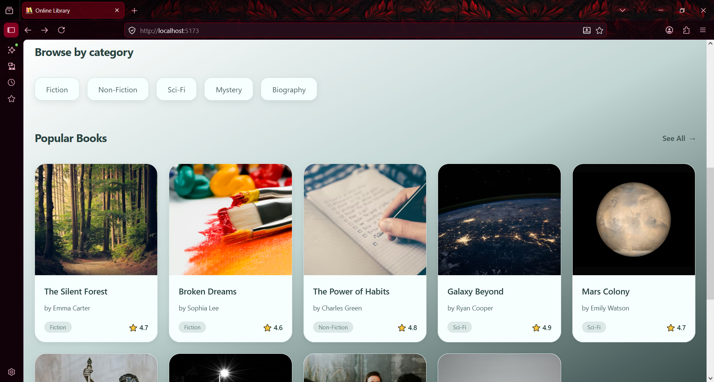
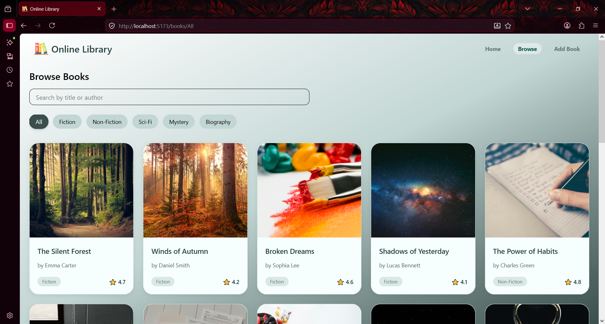
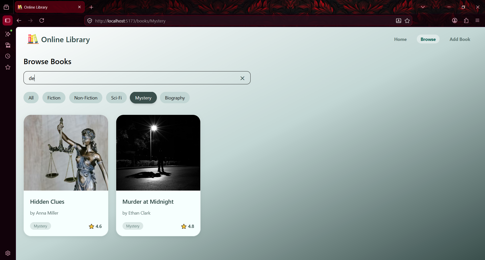
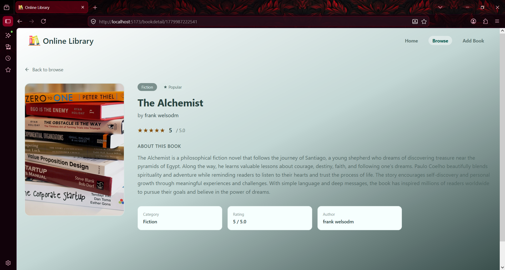
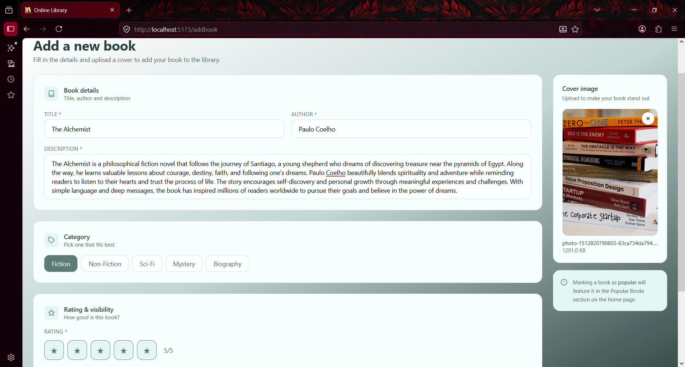
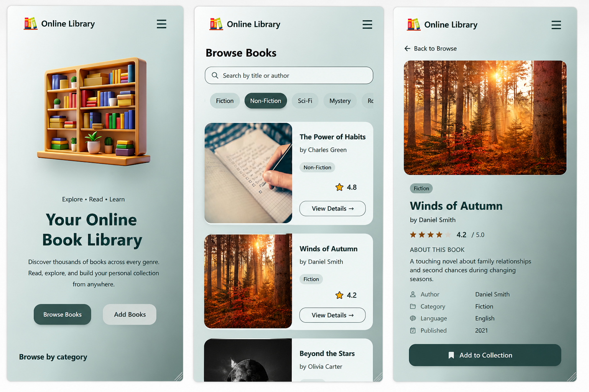

# Online Library 📚

An interactive and responsive Online Library web application built with **React**, **Vite**, **Redux Toolkit**, and **React Router**.
Users can browse books by category, search books, explore detailed book information, and add new books dynamically.

---

## 🚀 Features

* 📖 Browse books by categories
* 🔍 Search books by title or author
* 📚 View detailed information about each book
* ➕ Add new books dynamically
* 🧭 Dynamic routing with React Router
* ⚡ Fast performance with Vite
* 🎨 Modern responsive UI with Tailwind CSS
* ❌ Custom Error / Not Found page
* 🗂 Category-based filtering
* 🔄 Redux Toolkit state management
* 📱 Fully responsive for mobile, tablet, and desktop

---

# 🌐 Live Demo

🔗 Live Website:
https://online-book-library-management.netlify.app/

🔗 GitHub Repository:
https://github.com/monikamittal-1728/Online-Library.git

---

# 🛠 Tech Stack

* React
* Vite
* React Router DOM
* Redux Toolkit
* Tailwind CSS

---

# 📂 Project Structure

```bash
src/
│
├── components/
├── pages/
├── store/
├── data/
├── assets/
└── main.jsx
```

---

# 📸 Screenshots

## 1️⃣ Home Page



---

## 2️⃣ Home - Category & Popular Section



---

## 3️⃣ Browse Books Page



---

## 4️⃣ Search Books in Browse Page



---

## 5️⃣ Book Details Page



---

## 6️⃣ Add Book Page



---

## 7️⃣ Mobile View



---

# ⚙️ Installation & Setup

## Clone the repository

```bash
git clone https://github.com/monikamittal-1728/Online-Library.git
```

## Navigate to project folder

```bash
cd Online-Library
```

## Install dependencies

```bash
npm install
```

## Run development server

```bash
npm run dev
```

---

# ✨ Functionalities Implemented

* Dynamic category filtering
* URL parameter handling for categories
* Search functionality
* Reusable BookCard component
* Dynamic routing for book details
* Add Book form with validation
* Redux state management
* Responsive navbar with mobile menu
* Error page handling
* Clean UI with hover and active states
* Scroll behavior improvements
* Modern gradient-based UI design
* Mobile responsive layouts
* Component-based architecture

---

# 📱 Responsive Design

The application is fully responsive and optimized for:

* 📱 Mobile Devices
* 💻 Laptops
* 🖥 Desktop Screens
* 📟 Tablets

---

# 👩‍💻 Author

Made with ❤️ by Monika Gupta
